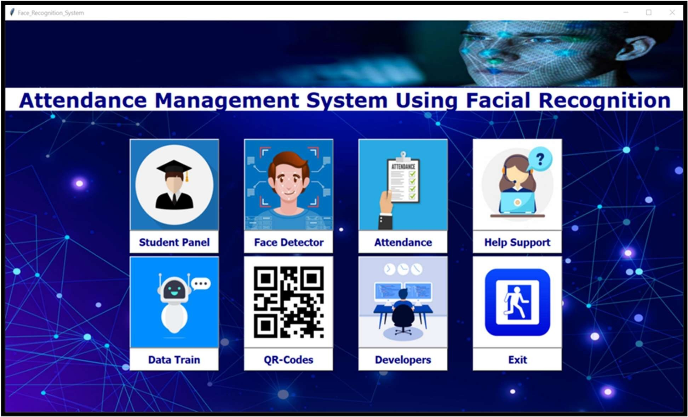
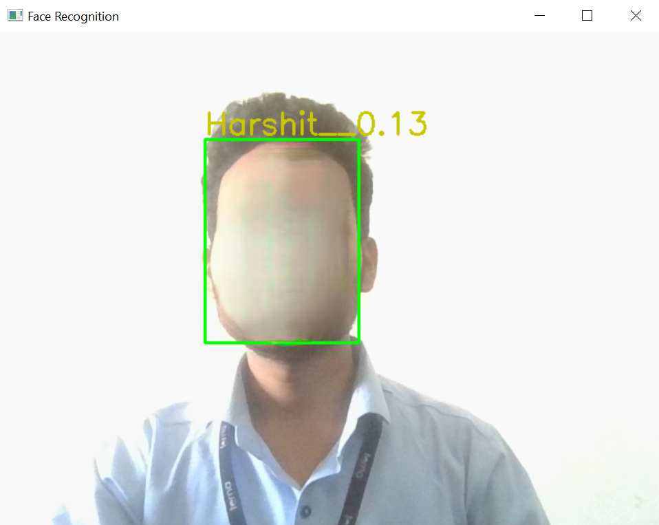
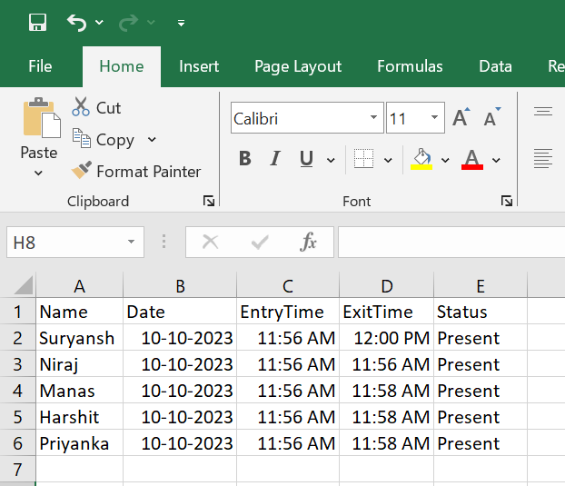

# 📸 Face Recognition Based Student Attendance System Using ML

An AI-powered attendance system that uses face recognition to automatically mark students' attendance. Built with Python and Machine Learning, the system integrates face detection, encoding, and classification models to log attendance securely and efficiently.

---

## 🧠 Technologies Used

- Python  
- OpenCV  
- TensorFlow / Keras  
- MTCNN for face detection  
- FaceNet for face embeddings  
- Support Vector Machine (SVM) for classification  
- Tkinter (GUI)  
- Firebase (optional)  
- Pandas, NumPy  

---

## 🚀 Features

- 🎯 Real-time face detection and recognition  
- 🧑‍🎓 Auto-attendance logging with name and timestamp  
- 📁 Dataset creation and embedding generation  
- 🗃️ Secure model training and classification using SVM  
- 📤 Export attendance logs to Excel  
- 🖥️ GUI interface using Tkinter  

---

## 📁 Folder Structure

```
.
├── Dataset/                  # Student face images
├── Images_GUI/               # UI and app icons
├── classifier/               # Trained SVM models
├── encodings/                # Face embeddings
├── architecture.py           # FaceNet model structure
├── facenet_keras_weights.h5  # Pre-trained FaceNet weights
├── generateDataset.py        # Script to capture student images
├── homepage.py               # GUI application
├── recognizer.py             # Face recognition and attendance logging
├── train_v2.py               # Train SVM on embeddings
├── requirements.txt          # Dependencies
```

---

## ⚙️ Installation

1. Clone the repository:

```bash
git clone https://github.com/xHarshit/Face-Recognition-Based-Student-Attendance-System-Using-ML.git
cd Face-Recognition-Based-Student-Attendance-System-Using-ML
```

2. Install the dependencies:

```bash
pip install -r requirements.txt
```

3. Run the GUI application:

```bash
python homepage.py
```

---

## 🖼️ Screenshots

1. Login and Home Page  
   

2. Dataset Creation & Training  
   

3. Face Recognition & Attendance Logging  
   

---

## 🧪 How It Works

1. Use generateDataset.py to capture images of each student.  
2. Train the classifier using train_v2.py.  
3. Launch the GUI with homepage.py.  
4. Recognizer detects faces from webcam and marks attendance in Excel and/or Firebase.

---

## 📈 Future Enhancements

- Add liveness detection to prevent spoofing  
- Create dashboard for admin analytics  
- Add notification system for parents  
- Mobile/web app integration for real-time access  

---

## 🪪 License

This project is licensed under the MIT License. See the LICENSE file for details.
